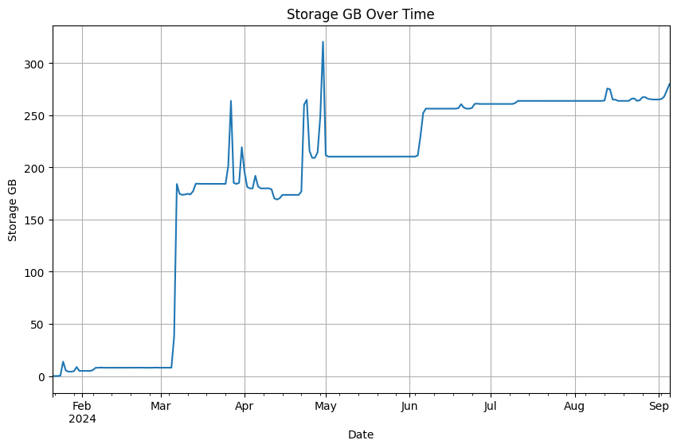

# “Snowflake Cortex Forecasting”


<!-- WARNING: THIS FILE WAS AUTOGENERATED! DO NOT EDIT! -->

# Documentation

> Note: This is a POC and is not production ready. This is a repository
> for the Cortex ML Function Forecasting. There are many updates that
> can be made to make this better and more robust for a production ready
> use case, but this will get you 80-90% of the way there for simple
> forecating use cases. This was developed in hopes that it would get
> you started on your forecasting journey. Then allow you to make
> adjustments to fit your specific use case.

## Overview

The
[`SnowflakeMLForecast`](https://sfc-gh-jdemlow.github.io/cortex_forecast/cortex_forecast.html#snowflakemlforecast)
class is a flexible tool designed for creating, managing, and analyzing
forecast models within Snowflake using the
`CREATE SNOWFLAKE.ML.FORECAST` functionality. It allows users to define
models, configure inputs, generate forecasts, and visualize results
seamlessly.

## Features

- Dynamic Forecast Model Creation: Automatically generates SQL queries
  to create forecast models based on configuration files.
- Visualization: Integrates with both Streamlit and standard Python
  environments to display forecast results and key data aspects.
- Tag Management: Handles the creation of tags in Snowflake and ensures
  smooth operation even if tags already exist.
- Configurable: Supports YAML configuration files for easy setup and
  flexibility.
- Error Handling: Robust error handling and user feedback for a seamless
  experience.

## Installation

### Requirements

- Python 3.7+
- Snowflake Connector
- Pandas
- Altair (for visualizations)
- Streamlit (optional, for UI)

### Setup

1.  Clone the Repository:

2.  Install Dependencies:

3.  Set Up Configuration: Create a YAML file with your configuration
    settings (explained below).

## Configuration

The
[`SnowflakeMLForecast`](https://sfc-gh-jdemlow.github.io/cortex_forecast/cortex_forecast.html#snowflakemlforecast)
class relies on a YAML configuration file to define the input data,
forecast settings, and other options. Below is an example configuration:

> This configuration is what is used in the storage example to be able
> to forecast your snowflake storage usage.

``` yaml
model:
  name: my_forecast_model
  tags:
    environment: production
    team: data_science
  comment: "Forecast model for predicting trends."

input_data:
  table: storage_usage_train
  table_type: table  # Options: 'table', 'view'
  timestamp_column: usage_date
  target_column: storage_gb
  series_column: null  # Set to column name for multiple time series
  exogenous_columns: # Or [column1, column2] if thre are no columns it will use all columns in the view or table
    - column1
    - column2

forecast_config:
  training_days: 180
  forecast_days: 30
  config_object:
    on_error: skip
    evaluate: true
    evaluation_config:
      n_splits: 2 # Default is 2
      gap: 0 # Default is 0
      prediction_interval: 0.95

output:
  table: storage_forecast_results
```

## Usage

### Creating a SnowflakeMLForecast Instance

``` python
# Step 1: Create a Forecast Model Instance

# Define your connection configuration
connection_config = {
    'user': 'your_user',
    'password': 'your_password',
    'account': 'your_account',
    'database': 'your_database',
    'warehouse': 'your_warehouse',
    'schema': 'your_schema',
    'role': 'your_role'
}

# Create an instance of SnowflakeMLForecast
forecast_model = SnowflakeMLForecast(
    config_file='path/to/your/config.yaml',
    connection_config=connection_config
)

# Step 2: Run Forecast and Visualize Results
forecast_model.generate_forecast_and_visualization(forecasting_period=30, confidence_interval=0.95)

# Step 3: Clean Up
forecast_model.cleanup()
```

# Full Example

> See in Docs/ folder for two example of this in action. One is for
> storage and the other is for Taxi Pick up in NYC.

``` python
from snowflake.snowpark.version import VERSION
from cortex_forecast.forecast import SnowflakeMLForecast
import os
```

## Create Snowflake Connection Using SnowflakeMLForecast

> Note: Make sure that you create a yaml file that you would like to so
> that the SnowflakeMLForecast can read the connection information from
> it and be able to build your forecast.

``` python
forecast_model = SnowflakeMLForecast(
    config_file='./cortex_forecast/files/yaml/storage_forecast_config.yaml',
    connection_config={
        'user': os.getenv('SNOWFLAKE_USER'),
        'password': os.getenv('SNOWFLAKE_PASSWORD'),
        'account': os.getenv('SNOWFLAKE_ACCOUNT'),
        'database': 'CORTEX',
        'warehouse': 'CORTEX_WH',
        'schema': 'DEV',
        'role': 'CORTEX_USER_ROLE'  # Use the desired role
    },
    is_streamlit=False
)

snowflake_environment = forecast_model.session.sql('SELECT current_user(), current_version()').collect()
snowpark_version = VERSION
print('\nConnection Established with the following parameters:')
print('Snowflake version           : {}'.format(snowflake_environment[0][1]))
print('Snowpark for Python version : {}.{}.{}'.format(snowpark_version[0], snowpark_version[1], snowpark_version[2]))
```


    Connection Established with the following parameters:
    Snowflake version           : 8.33.1
    Snowpark for Python version : 1.18.0

``` python
# Create Training Data
training_days = 365

forecast_model.session.sql(f'''CREATE OR REPLACE TABLE storage_usage_train AS
    SELECT 
        TO_TIMESTAMP_NTZ(usage_date) AS usage_date,
        storage_bytes / POWER(1024, 3) AS storage_gb
    FROM 
    (
        SELECT * 
            FROM snowflake.account_usage.storage_usage
            WHERE usage_date < CURRENT_DATE()
    )
    WHERE TO_TIMESTAMP_NTZ(usage_date) > DATEADD(day, -{training_days}, CURRENT_DATE())
''').collect()
forecast_model.session.sql('SELECT * FROM storage_usage_train ORDER BY usage_date DESC LIMIT 10').show()
```

    --------------------------------------------
    |"USAGE_DATE"         |"STORAGE_GB"        |
    --------------------------------------------
    |2024-09-05 00:00:00  |279.8410659143701   |
    |2024-09-04 00:00:00  |273.75833379570395  |
    |2024-09-03 00:00:00  |267.7940624393523   |
    |2024-09-02 00:00:00  |265.5218228260055   |
    |2024-09-01 00:00:00  |265.05640272889286  |
    |2024-08-31 00:00:00  |265.0566206406802   |
    |2024-08-30 00:00:00  |265.0504933735356   |
    |2024-08-29 00:00:00  |265.32130791060627  |
    |2024-08-28 00:00:00  |265.77701564040035  |
    |2024-08-27 00:00:00  |267.33904562331736  |
    --------------------------------------------

``` python
import pandas as pd
import matplotlib.pyplot as plt
```

``` python
df = forecast_model.session.sql('SELECT * FROM storage_usage_train ORDER BY usage_date').to_pandas()
df.head()
df = df.set_index('USAGE_DATE')
df['STORAGE_GB'].plot(figsize=(10, 6), title='Storage GB Over Time')

# Show the plot
plt.xlabel('Date')
plt.ylabel('Storage GB')
plt.grid(True)
plt.show()
```



### Train a Model

> This will use what is inside of the yaml file that you created that
> you passed over to the SnowflakeMLForecast object

``` python
# Run Forecast
forecast_data = forecast_model.create_and_run_forecast()
forecast_data.head()
```

    Attempting to create tag: environment
    Tag 'environment' already exists.
    Attempting to create tag: team
    Tag 'team' already exists.
    Step 1/4: Creating training table...
    Generated SQL:

            CREATE OR REPLACE TEMPORARY TABLE my_forecast_model_20240906_mdwlv_train AS
            SELECT TO_TIMESTAMP_NTZ(usage_date) AS usage_date, storage_gb AS storage_gb, * EXCLUDE (usage_date, storage_gb)
            FROM storage_usage_train
            
                WHERE TO_TIMESTAMP_NTZ(usage_date) 
                BETWEEN 
                DATEADD(day, -365, (SELECT MAX(usage_date) FROM storage_usage_train)) 
                AND 
                (SELECT MAX(usage_date) FROM storage_usage_train)
                ;
    Step 2/4: Creating forecast model...
    Generated SQL:

            CREATE OR REPLACE SNOWFLAKE.ML.FORECAST my_forecast_model_20240906_mdwlv(
                INPUT_DATA => SYSTEM$REFERENCE('table', 'my_forecast_model_20240906_mdwlv_train'),
                TIMESTAMP_COLNAME => 'usage_date',
                TARGET_COLNAME => 'storage_gb',
            CONFIG_OBJECT => {'on_error': 'skip', 'evaluate': TRUE, 'evaluation_config': {'n_splits': 2, 'gap': 0, 'prediction_interval': 0.95}}) WITH TAG (environment = 'production', team = 'data_science') COMMENT = 'Forecast model for predicting sales trends.';
    Step 3/4: Generating forecasts...
    Generated Forecast SQL:
    CREATE OR REPLACE TABLE storage_forecast_results AS SELECT 
                    ts AS usage_date,
                    CASE WHEN forecast < 0 THEN 0 ELSE forecast END AS forecast,
                    CASE WHEN lower_bound < 0 THEN 0 ELSE lower_bound END AS lower_bound,
                    CASE WHEN upper_bound < 0 THEN 0 ELSE upper_bound END AS upper_bound,
                    'my_forecast_model_20240906_mdwlv' AS model_name,
                    CURRENT_TIMESTAMP() AS creation_date,
                    'Forecast model for predicting sales trends.' AS model_comment
                FROM
                    TABLE(my_forecast_model_20240906_mdwlv!FORECAST(
                CONFIG_OBJECT => {'prediction_interval': 0.95}
    , FORECASTING_PERIODS => 30));
    Step 4/4: Fetching forecast results...

<div>
<style scoped>
    .dataframe tbody tr th:only-of-type {
        vertical-align: middle;
    }
&#10;    .dataframe tbody tr th {
        vertical-align: top;
    }
&#10;    .dataframe thead th {
        text-align: right;
    }
</style>

|  | USAGE_DATE | FORECAST | LOWER_BOUND | UPPER_BOUND | MODEL_NAME | CREATION_DATE | MODEL_COMMENT |
|----|----|----|----|----|----|----|----|
| 0 | 2024-09-06 | 279.628776 | 277.026308 | 282.231245 | my_forecast_model_20240906_mdwlv | 2024-09-06 15:05:16.877000-07:00 | Forecast model for predicting sales trends. |
| 1 | 2024-09-07 | 278.653023 | 274.972576 | 282.333469 | my_forecast_model_20240906_mdwlv | 2024-09-06 15:05:16.877000-07:00 | Forecast model for predicting sales trends. |
| 2 | 2024-09-08 | 278.725210 | 274.217602 | 283.232819 | my_forecast_model_20240906_mdwlv | 2024-09-06 15:05:16.877000-07:00 | Forecast model for predicting sales trends. |
| 3 | 2024-09-09 | 278.646488 | 273.441550 | 283.851426 | my_forecast_model_20240906_mdwlv | 2024-09-06 15:05:16.877000-07:00 | Forecast model for predicting sales trends. |
| 4 | 2024-09-10 | 277.903107 | 272.083810 | 283.722405 | my_forecast_model_20240906_mdwlv | 2024-09-06 15:05:16.877000-07:00 | Forecast model for predicting sales trends. |

</div>

### Visualize Forecast

``` python
forecast_model.generate_forecast_and_visualization(show_historical=True)
```

    Executing forecast query:

                SELECT *
                FROM storage_forecast_results
                WHERE model_name = 'my_forecast_model_20240906_mdwlv'
                ORDER BY usage_date DESC
            
    Forecast data preview (last 5 rows):

<div>
<style scoped>
    .dataframe tbody tr th:only-of-type {
        vertical-align: middle;
    }
&#10;    .dataframe tbody tr th {
        vertical-align: top;
    }
&#10;    .dataframe thead th {
        text-align: right;
    }
</style>

|  | USAGE_DATE | FORECAST | LOWER_BOUND | UPPER_BOUND | MODEL_NAME | CREATION_DATE | MODEL_COMMENT |
|----|----|----|----|----|----|----|----|
| 25 | 2024-09-10 | 277.903107 | 272.083810 | 283.722405 | my_forecast_model_20240906_mdwlv | 2024-09-06 15:05:16.877000-07:00 | Forecast model for predicting sales trends. |
| 26 | 2024-09-09 | 278.646488 | 273.441550 | 283.851426 | my_forecast_model_20240906_mdwlv | 2024-09-06 15:05:16.877000-07:00 | Forecast model for predicting sales trends. |
| 27 | 2024-09-08 | 278.725210 | 274.217602 | 283.232819 | my_forecast_model_20240906_mdwlv | 2024-09-06 15:05:16.877000-07:00 | Forecast model for predicting sales trends. |
| 28 | 2024-09-07 | 278.653023 | 274.972576 | 282.333469 | my_forecast_model_20240906_mdwlv | 2024-09-06 15:05:16.877000-07:00 | Forecast model for predicting sales trends. |
| 29 | 2024-09-06 | 279.628776 | 277.026308 | 282.231245 | my_forecast_model_20240906_mdwlv | 2024-09-06 15:05:16.877000-07:00 | Forecast model for predicting sales trends. |

</div>

    Executing historic actuals query:

                SELECT usage_date, storage_gb
                FROM storage_usage_train
                ORDER BY usage_date DESC
                LIMIT 21
                
    Historical data preview (last 5 rows):

<div>
<style scoped>
    .dataframe tbody tr th:only-of-type {
        vertical-align: middle;
    }
&#10;    .dataframe tbody tr th {
        vertical-align: top;
    }
&#10;    .dataframe thead th {
        text-align: right;
    }
</style>

|     | USAGE_DATE | STORAGE_GB |
|-----|------------|------------|
| 16  | 2024-08-20 | 263.743386 |
| 17  | 2024-08-19 | 263.740114 |
| 18  | 2024-08-18 | 263.736670 |
| 19  | 2024-08-17 | 263.737937 |
| 20  | 2024-08-16 | 264.926883 |

</div>

    Getting historical max date
    Max historical date: 2024-09-05 00:00:00
    Combined data preview (last 5 rows):

<div>
<style scoped>
    .dataframe tbody tr th:only-of-type {
        vertical-align: middle;
    }
&#10;    .dataframe tbody tr th {
        vertical-align: top;
    }
&#10;    .dataframe thead th {
        text-align: right;
    }
</style>

|     | USAGE_DATE | TYPE     | VALUE_TYPE  | VOLUME     |
|-----|------------|----------|-------------|------------|
| 127 | 2024-09-10 | Forecast | UPPER_BOUND | 283.722405 |
| 128 | 2024-09-09 | Forecast | UPPER_BOUND | 283.851426 |
| 129 | 2024-09-08 | Forecast | UPPER_BOUND | 283.232819 |
| 130 | 2024-09-07 | Forecast | UPPER_BOUND | 282.333469 |
| 131 | 2024-09-06 | Forecast | UPPER_BOUND | 282.231245 |

</div>

<style>
  #altair-viz-5e52dce4757c4dcca86c861ce9c6df98.vega-embed {
    width: 100%;
    display: flex;
  }
&#10;  #altair-viz-5e52dce4757c4dcca86c861ce9c6df98.vega-embed details,
  #altair-viz-5e52dce4757c4dcca86c861ce9c6df98.vega-embed details summary {
    position: relative;
  }
</style>
<div id="altair-viz-5e52dce4757c4dcca86c861ce9c6df98"></div>
<script type="text/javascript">
  var VEGA_DEBUG = (typeof VEGA_DEBUG == "undefined") ? {} : VEGA_DEBUG;
  (function(spec, embedOpt){
    let outputDiv = document.currentScript.previousElementSibling;
    if (outputDiv.id !== "altair-viz-5e52dce4757c4dcca86c861ce9c6df98") {
      outputDiv = document.getElementById("altair-viz-5e52dce4757c4dcca86c861ce9c6df98");
    }
    const paths = {
      "vega": "https://cdn.jsdelivr.net/npm/vega@5?noext",
      "vega-lib": "https://cdn.jsdelivr.net/npm/vega-lib?noext",
      "vega-lite": "https://cdn.jsdelivr.net/npm/vega-lite@5.17.0?noext",
      "vega-embed": "https://cdn.jsdelivr.net/npm/vega-embed@6?noext",
    };
&#10;    function maybeLoadScript(lib, version) {
      var key = `${lib.replace("-", "")}_version`;
      return (VEGA_DEBUG[key] == version) ?
        Promise.resolve(paths[lib]) :
        new Promise(function(resolve, reject) {
          var s = document.createElement('script');
          document.getElementsByTagName("head")[0].appendChild(s);
          s.async = true;
          s.onload = () => {
            VEGA_DEBUG[key] = version;
            return resolve(paths[lib]);
          };
          s.onerror = () => reject(`Error loading script: ${paths[lib]}`);
          s.src = paths[lib];
        });
    }
&#10;    function showError(err) {
      outputDiv.innerHTML = `<div class="error" style="color:red;">${err}</div>`;
      throw err;
    }
&#10;    function displayChart(vegaEmbed) {
      vegaEmbed(outputDiv, spec, embedOpt)
        .catch(err => showError(`Javascript Error: ${err.message}<br>This usually means there's a typo in your chart specification. See the javascript console for the full traceback.`));
    }
&#10;    if(typeof define === "function" && define.amd) {
      requirejs.config({paths});
      require(["vega-embed"], displayChart, err => showError(`Error loading script: ${err.message}`));
    } else {
      maybeLoadScript("vega", "5")
        .then(() => maybeLoadScript("vega-lite", "5.17.0"))
        .then(() => maybeLoadScript("vega-embed", "6"))
        .catch(showError)
        .then(() => displayChart(vegaEmbed));
    }
  })({"config": {"view": {"continuousWidth": 300, "continuousHeight": 300}}, "layer": [{"data": {"name": "data-e5a8b4f33794cb7004ddd5d9c1fd40ec"}, "mark": {"type": "line", "point": true}, "encoding": {"color": {"field": "VALUE_TYPE", "legend": {"title": "Forecast Type"}, "type": "nominal"}, "strokeDash": {"field": "TYPE", "legend": {"title": "Data Type"}, "type": "nominal"}, "x": {"axis": {"title": "Date"}, "field": "USAGE_DATE", "type": "temporal"}, "y": {"field": "VOLUME", "type": "quantitative"}}, "title": {"text": ["Forecast and Historic Volume"], "subtitle": ["Comparing forecasted volume with historic data"], "color": "black", "subtitleColor": "gray"}}, {"data": {"name": "data-5450400812ce499562c0843b9076e4ae"}, "mark": {"type": "rule", "color": "orange", "strokeDash": [5, 5]}, "encoding": {"x": {"field": "x", "type": "temporal"}}}, {"data": {"name": "data-a034946551d9b52a71d98e605fad923f"}, "mark": {"type": "text", "align": "left", "baseline": "bottom", "dx": 5, "dy": 5, "fontSize": 12}, "encoding": {"text": {"field": "label", "type": "nominal"}, "x": {"field": "x", "type": "temporal"}, "y": {"value": 5}}}], "height": 400, "width": 800, "$schema": "https://vega.github.io/schema/vega-lite/v5.17.0.json", "datasets": {"data-e5a8b4f33794cb7004ddd5d9c1fd40ec": [{"USAGE_DATE": "2024-10-05T00:00:00", "TYPE": "Forecast", "VALUE_TYPE": "FORECAST", "VOLUME": 285.187184811}, {"USAGE_DATE": "2024-10-04T00:00:00", "TYPE": "Forecast", "VALUE_TYPE": "FORECAST", "VOLUME": 284.395556693}, {"USAGE_DATE": "2024-10-03T00:00:00", "TYPE": "Forecast", "VALUE_TYPE": "FORECAST", "VOLUME": 283.692142394}, {"USAGE_DATE": "2024-10-02T00:00:00", "TYPE": "Forecast", "VALUE_TYPE": "FORECAST", "VOLUME": 282.776330199}, {"USAGE_DATE": "2024-10-01T00:00:00", "TYPE": "Forecast", "VALUE_TYPE": "FORECAST", "VOLUME": 282.348245612}, {"USAGE_DATE": "2024-09-30T00:00:00", "TYPE": "Forecast", "VALUE_TYPE": "FORECAST", "VOLUME": 287.954502448}, {"USAGE_DATE": "2024-09-29T00:00:00", "TYPE": "Forecast", "VALUE_TYPE": "FORECAST", "VOLUME": 287.469436833}, {"USAGE_DATE": "2024-09-28T00:00:00", "TYPE": "Forecast", "VALUE_TYPE": "FORECAST", "VOLUME": 287.068965198}, {"USAGE_DATE": "2024-09-27T00:00:00", "TYPE": "Forecast", "VALUE_TYPE": "FORECAST", "VOLUME": 286.448450378}, {"USAGE_DATE": "2024-09-26T00:00:00", "TYPE": "Forecast", "VALUE_TYPE": "FORECAST", "VOLUME": 286.330705755}, {"USAGE_DATE": "2024-09-25T00:00:00", "TYPE": "Forecast", "VALUE_TYPE": "FORECAST", "VOLUME": 286.024608762}, {"USAGE_DATE": "2024-09-24T00:00:00", "TYPE": "Forecast", "VALUE_TYPE": "FORECAST", "VOLUME": 285.609234836}, {"USAGE_DATE": "2024-09-23T00:00:00", "TYPE": "Forecast", "VALUE_TYPE": "FORECAST", "VOLUME": 284.976855988}, {"USAGE_DATE": "2024-09-22T00:00:00", "TYPE": "Forecast", "VALUE_TYPE": "FORECAST", "VOLUME": 284.238151068}, {"USAGE_DATE": "2024-09-21T00:00:00", "TYPE": "Forecast", "VALUE_TYPE": "FORECAST", "VOLUME": 283.419224784}, {"USAGE_DATE": "2024-09-20T00:00:00", "TYPE": "Forecast", "VALUE_TYPE": "FORECAST", "VOLUME": 281.800196614}, {"USAGE_DATE": "2024-09-19T00:00:00", "TYPE": "Forecast", "VALUE_TYPE": "FORECAST", "VOLUME": 280.781407471}, {"USAGE_DATE": "2024-09-18T00:00:00", "TYPE": "Forecast", "VALUE_TYPE": "FORECAST", "VOLUME": 280.900519068}, {"USAGE_DATE": "2024-09-17T00:00:00", "TYPE": "Forecast", "VALUE_TYPE": "FORECAST", "VOLUME": 279.868094199}, {"USAGE_DATE": "2024-09-16T00:00:00", "TYPE": "Forecast", "VALUE_TYPE": "FORECAST", "VOLUME": 278.594452286}, {"USAGE_DATE": "2024-09-15T00:00:00", "TYPE": "Forecast", "VALUE_TYPE": "FORECAST", "VOLUME": 277.218847095}, {"USAGE_DATE": "2024-09-14T00:00:00", "TYPE": "Forecast", "VALUE_TYPE": "FORECAST", "VOLUME": 276.089697239}, {"USAGE_DATE": "2024-09-13T00:00:00", "TYPE": "Forecast", "VALUE_TYPE": "FORECAST", "VOLUME": 274.518960781}, {"USAGE_DATE": "2024-09-12T00:00:00", "TYPE": "Forecast", "VALUE_TYPE": "FORECAST", "VOLUME": 277.932711869}, {"USAGE_DATE": "2024-09-11T00:00:00", "TYPE": "Forecast", "VALUE_TYPE": "FORECAST", "VOLUME": 278.281122945}, {"USAGE_DATE": "2024-09-10T00:00:00", "TYPE": "Forecast", "VALUE_TYPE": "FORECAST", "VOLUME": 277.903107433}, {"USAGE_DATE": "2024-09-09T00:00:00", "TYPE": "Forecast", "VALUE_TYPE": "FORECAST", "VOLUME": 278.646487728}, {"USAGE_DATE": "2024-09-08T00:00:00", "TYPE": "Forecast", "VALUE_TYPE": "FORECAST", "VOLUME": 278.725210153}, {"USAGE_DATE": "2024-09-07T00:00:00", "TYPE": "Forecast", "VALUE_TYPE": "FORECAST", "VOLUME": 278.653022609}, {"USAGE_DATE": "2024-09-06T00:00:00", "TYPE": "Forecast", "VALUE_TYPE": "FORECAST", "VOLUME": 279.62877648}, {"USAGE_DATE": "2024-09-05T00:00:00", "TYPE": "Historic", "VALUE_TYPE": "FORECAST", "VOLUME": 279.8410659143701}, {"USAGE_DATE": "2024-09-04T00:00:00", "TYPE": "Historic", "VALUE_TYPE": "FORECAST", "VOLUME": 273.75833379570395}, {"USAGE_DATE": "2024-09-03T00:00:00", "TYPE": "Historic", "VALUE_TYPE": "FORECAST", "VOLUME": 267.7940624393523}, {"USAGE_DATE": "2024-09-02T00:00:00", "TYPE": "Historic", "VALUE_TYPE": "FORECAST", "VOLUME": 265.5218228260055}, {"USAGE_DATE": "2024-09-01T00:00:00", "TYPE": "Historic", "VALUE_TYPE": "FORECAST", "VOLUME": 265.05640272889286}, {"USAGE_DATE": "2024-08-31T00:00:00", "TYPE": "Historic", "VALUE_TYPE": "FORECAST", "VOLUME": 265.0566206406802}, {"USAGE_DATE": "2024-08-30T00:00:00", "TYPE": "Historic", "VALUE_TYPE": "FORECAST", "VOLUME": 265.0504933735356}, {"USAGE_DATE": "2024-08-29T00:00:00", "TYPE": "Historic", "VALUE_TYPE": "FORECAST", "VOLUME": 265.32130791060627}, {"USAGE_DATE": "2024-08-28T00:00:00", "TYPE": "Historic", "VALUE_TYPE": "FORECAST", "VOLUME": 265.77701564040035}, {"USAGE_DATE": "2024-08-27T00:00:00", "TYPE": "Historic", "VALUE_TYPE": "FORECAST", "VOLUME": 267.33904562331736}, {"USAGE_DATE": "2024-08-26T00:00:00", "TYPE": "Historic", "VALUE_TYPE": "FORECAST", "VOLUME": 267.2409431748092}, {"USAGE_DATE": "2024-08-25T00:00:00", "TYPE": "Historic", "VALUE_TYPE": "FORECAST", "VOLUME": 264.4189388444647}, {"USAGE_DATE": "2024-08-24T00:00:00", "TYPE": "Historic", "VALUE_TYPE": "FORECAST", "VOLUME": 263.7401035623625}, {"USAGE_DATE": "2024-08-23T00:00:00", "TYPE": "Historic", "VALUE_TYPE": "FORECAST", "VOLUME": 266.04881395213306}, {"USAGE_DATE": "2024-08-22T00:00:00", "TYPE": "Historic", "VALUE_TYPE": "FORECAST", "VOLUME": 265.8021299690008}, {"USAGE_DATE": "2024-08-21T00:00:00", "TYPE": "Historic", "VALUE_TYPE": "FORECAST", "VOLUME": 263.84100852534175}, {"USAGE_DATE": "2024-08-20T00:00:00", "TYPE": "Historic", "VALUE_TYPE": "FORECAST", "VOLUME": 263.74338578339666}, {"USAGE_DATE": "2024-08-19T00:00:00", "TYPE": "Historic", "VALUE_TYPE": "FORECAST", "VOLUME": 263.7401140583679}, {"USAGE_DATE": "2024-08-18T00:00:00", "TYPE": "Historic", "VALUE_TYPE": "FORECAST", "VOLUME": 263.7366697881371}, {"USAGE_DATE": "2024-08-17T00:00:00", "TYPE": "Historic", "VALUE_TYPE": "FORECAST", "VOLUME": 263.73793654982}, {"USAGE_DATE": "2024-08-16T00:00:00", "TYPE": "Historic", "VALUE_TYPE": "FORECAST", "VOLUME": 264.9268829189241}, {"USAGE_DATE": "2024-10-05T00:00:00", "TYPE": "Forecast", "VALUE_TYPE": "LOWER_BOUND", "VOLUME": 270.932875462}, {"USAGE_DATE": "2024-10-04T00:00:00", "TYPE": "Forecast", "VALUE_TYPE": "LOWER_BOUND", "VOLUME": 270.380832632}, {"USAGE_DATE": "2024-10-03T00:00:00", "TYPE": "Forecast", "VALUE_TYPE": "LOWER_BOUND", "VOLUME": 269.921171258}, {"USAGE_DATE": "2024-10-02T00:00:00", "TYPE": "Forecast", "VALUE_TYPE": "LOWER_BOUND", "VOLUME": 269.253504995}, {"USAGE_DATE": "2024-10-01T00:00:00", "TYPE": "Forecast", "VALUE_TYPE": "LOWER_BOUND", "VOLUME": 269.078205785}, {"USAGE_DATE": "2024-09-30T00:00:00", "TYPE": "Forecast", "VALUE_TYPE": "LOWER_BOUND", "VOLUME": 274.942157828}, {"USAGE_DATE": "2024-09-29T00:00:00", "TYPE": "Forecast", "VALUE_TYPE": "LOWER_BOUND", "VOLUME": 274.719994962}, {"USAGE_DATE": "2024-09-28T00:00:00", "TYPE": "Forecast", "VALUE_TYPE": "LOWER_BOUND", "VOLUME": 274.587962694}, {"USAGE_DATE": "2024-09-27T00:00:00", "TYPE": "Forecast", "VALUE_TYPE": "LOWER_BOUND", "VOLUME": 274.241789123}, {"USAGE_DATE": "2024-09-26T00:00:00", "TYPE": "Forecast", "VALUE_TYPE": "LOWER_BOUND", "VOLUME": 274.404694917}, {"USAGE_DATE": "2024-09-25T00:00:00", "TYPE": "Forecast", "VALUE_TYPE": "LOWER_BOUND", "VOLUME": 274.386013915}, {"USAGE_DATE": "2024-09-24T00:00:00", "TYPE": "Forecast", "VALUE_TYPE": "LOWER_BOUND", "VOLUME": 274.265335793}, {"USAGE_DATE": "2024-09-23T00:00:00", "TYPE": "Forecast", "VALUE_TYPE": "LOWER_BOUND", "VOLUME": 273.935515444}, {"USAGE_DATE": "2024-09-22T00:00:00", "TYPE": "Forecast", "VALUE_TYPE": "LOWER_BOUND", "VOLUME": 273.507896807}, {"USAGE_DATE": "2024-09-21T00:00:00", "TYPE": "Forecast", "VALUE_TYPE": "LOWER_BOUND", "VOLUME": 273.009349088}, {"USAGE_DATE": "2024-09-20T00:00:00", "TYPE": "Forecast", "VALUE_TYPE": "LOWER_BOUND", "VOLUME": 271.720877812}, {"USAGE_DATE": "2024-09-19T00:00:00", "TYPE": "Forecast", "VALUE_TYPE": "LOWER_BOUND", "VOLUME": 271.043860397}, {"USAGE_DATE": "2024-09-18T00:00:00", "TYPE": "Forecast", "VALUE_TYPE": "LOWER_BOUND", "VOLUME": 271.51718392}, {"USAGE_DATE": "2024-09-17T00:00:00", "TYPE": "Forecast", "VALUE_TYPE": "LOWER_BOUND", "VOLUME": 270.852877396}, {"USAGE_DATE": "2024-09-16T00:00:00", "TYPE": "Forecast", "VALUE_TYPE": "LOWER_BOUND", "VOLUME": 269.963039337}, {"USAGE_DATE": "2024-09-15T00:00:00", "TYPE": "Forecast", "VALUE_TYPE": "LOWER_BOUND", "VOLUME": 268.989117755}, {"USAGE_DATE": "2024-09-14T00:00:00", "TYPE": "Forecast", "VALUE_TYPE": "LOWER_BOUND", "VOLUME": 268.282290468}, {"USAGE_DATE": "2024-09-13T00:00:00", "TYPE": "Forecast", "VALUE_TYPE": "LOWER_BOUND", "VOLUME": 267.158067085}, {"USAGE_DATE": "2024-09-12T00:00:00", "TYPE": "Forecast", "VALUE_TYPE": "LOWER_BOUND", "VOLUME": 271.047226301}, {"USAGE_DATE": "2024-09-11T00:00:00", "TYPE": "Forecast", "VALUE_TYPE": "LOWER_BOUND", "VOLUME": 271.906402009}, {"USAGE_DATE": "2024-09-10T00:00:00", "TYPE": "Forecast", "VALUE_TYPE": "LOWER_BOUND", "VOLUME": 272.083810009}, {"USAGE_DATE": "2024-09-09T00:00:00", "TYPE": "Forecast", "VALUE_TYPE": "LOWER_BOUND", "VOLUME": 273.44154988}, {"USAGE_DATE": "2024-09-08T00:00:00", "TYPE": "Forecast", "VALUE_TYPE": "LOWER_BOUND", "VOLUME": 274.217601752}, {"USAGE_DATE": "2024-09-07T00:00:00", "TYPE": "Forecast", "VALUE_TYPE": "LOWER_BOUND", "VOLUME": 274.972575761}, {"USAGE_DATE": "2024-09-06T00:00:00", "TYPE": "Forecast", "VALUE_TYPE": "LOWER_BOUND", "VOLUME": 277.026307557}, {"USAGE_DATE": "2024-10-05T00:00:00", "TYPE": "Forecast", "VALUE_TYPE": "UPPER_BOUND", "VOLUME": 299.441494159}, {"USAGE_DATE": "2024-10-04T00:00:00", "TYPE": "Forecast", "VALUE_TYPE": "UPPER_BOUND", "VOLUME": 298.410280754}, {"USAGE_DATE": "2024-10-03T00:00:00", "TYPE": "Forecast", "VALUE_TYPE": "UPPER_BOUND", "VOLUME": 297.463113529}, {"USAGE_DATE": "2024-10-02T00:00:00", "TYPE": "Forecast", "VALUE_TYPE": "UPPER_BOUND", "VOLUME": 296.299155403}, {"USAGE_DATE": "2024-10-01T00:00:00", "TYPE": "Forecast", "VALUE_TYPE": "UPPER_BOUND", "VOLUME": 295.618285439}, {"USAGE_DATE": "2024-09-30T00:00:00", "TYPE": "Forecast", "VALUE_TYPE": "UPPER_BOUND", "VOLUME": 300.966847068}, {"USAGE_DATE": "2024-09-29T00:00:00", "TYPE": "Forecast", "VALUE_TYPE": "UPPER_BOUND", "VOLUME": 300.218878703}, {"USAGE_DATE": "2024-09-28T00:00:00", "TYPE": "Forecast", "VALUE_TYPE": "UPPER_BOUND", "VOLUME": 299.549967702}, {"USAGE_DATE": "2024-09-27T00:00:00", "TYPE": "Forecast", "VALUE_TYPE": "UPPER_BOUND", "VOLUME": 298.655111634}, {"USAGE_DATE": "2024-09-26T00:00:00", "TYPE": "Forecast", "VALUE_TYPE": "UPPER_BOUND", "VOLUME": 298.256716593}, {"USAGE_DATE": "2024-09-25T00:00:00", "TYPE": "Forecast", "VALUE_TYPE": "UPPER_BOUND", "VOLUME": 297.663203609}, {"USAGE_DATE": "2024-09-24T00:00:00", "TYPE": "Forecast", "VALUE_TYPE": "UPPER_BOUND", "VOLUME": 296.953133879}, {"USAGE_DATE": "2024-09-23T00:00:00", "TYPE": "Forecast", "VALUE_TYPE": "UPPER_BOUND", "VOLUME": 296.018196532}, {"USAGE_DATE": "2024-09-22T00:00:00", "TYPE": "Forecast", "VALUE_TYPE": "UPPER_BOUND", "VOLUME": 294.968405329}, {"USAGE_DATE": "2024-09-21T00:00:00", "TYPE": "Forecast", "VALUE_TYPE": "UPPER_BOUND", "VOLUME": 293.82910048}, {"USAGE_DATE": "2024-09-20T00:00:00", "TYPE": "Forecast", "VALUE_TYPE": "UPPER_BOUND", "VOLUME": 291.879515415}, {"USAGE_DATE": "2024-09-19T00:00:00", "TYPE": "Forecast", "VALUE_TYPE": "UPPER_BOUND", "VOLUME": 290.518954544}, {"USAGE_DATE": "2024-09-18T00:00:00", "TYPE": "Forecast", "VALUE_TYPE": "UPPER_BOUND", "VOLUME": 290.283854217}, {"USAGE_DATE": "2024-09-17T00:00:00", "TYPE": "Forecast", "VALUE_TYPE": "UPPER_BOUND", "VOLUME": 288.883311002}, {"USAGE_DATE": "2024-09-16T00:00:00", "TYPE": "Forecast", "VALUE_TYPE": "UPPER_BOUND", "VOLUME": 287.225865235}, {"USAGE_DATE": "2024-09-15T00:00:00", "TYPE": "Forecast", "VALUE_TYPE": "UPPER_BOUND", "VOLUME": 285.448576434}, {"USAGE_DATE": "2024-09-14T00:00:00", "TYPE": "Forecast", "VALUE_TYPE": "UPPER_BOUND", "VOLUME": 283.897104011}, {"USAGE_DATE": "2024-09-13T00:00:00", "TYPE": "Forecast", "VALUE_TYPE": "UPPER_BOUND", "VOLUME": 281.879854476}, {"USAGE_DATE": "2024-09-12T00:00:00", "TYPE": "Forecast", "VALUE_TYPE": "UPPER_BOUND", "VOLUME": 284.818197437}, {"USAGE_DATE": "2024-09-11T00:00:00", "TYPE": "Forecast", "VALUE_TYPE": "UPPER_BOUND", "VOLUME": 284.65584388}, {"USAGE_DATE": "2024-09-10T00:00:00", "TYPE": "Forecast", "VALUE_TYPE": "UPPER_BOUND", "VOLUME": 283.722404856}, {"USAGE_DATE": "2024-09-09T00:00:00", "TYPE": "Forecast", "VALUE_TYPE": "UPPER_BOUND", "VOLUME": 283.851425576}, {"USAGE_DATE": "2024-09-08T00:00:00", "TYPE": "Forecast", "VALUE_TYPE": "UPPER_BOUND", "VOLUME": 283.232818555}, {"USAGE_DATE": "2024-09-07T00:00:00", "TYPE": "Forecast", "VALUE_TYPE": "UPPER_BOUND", "VOLUME": 282.333469457}, {"USAGE_DATE": "2024-09-06T00:00:00", "TYPE": "Forecast", "VALUE_TYPE": "UPPER_BOUND", "VOLUME": 282.231245404}], "data-5450400812ce499562c0843b9076e4ae": [{"x": "2024-09-05T00:00:00"}], "data-a034946551d9b52a71d98e605fad923f": [{"x": "2024-09-05T00:00:00", "label": "Forecast -->"}]}}, {"mode": "vega-lite"});
</script>

    Top 10 Feature Importances

<style>
  #altair-viz-5120c8e8a7a540018710cf62fae7b0b6.vega-embed {
    width: 100%;
    display: flex;
  }
&#10;  #altair-viz-5120c8e8a7a540018710cf62fae7b0b6.vega-embed details,
  #altair-viz-5120c8e8a7a540018710cf62fae7b0b6.vega-embed details summary {
    position: relative;
  }
</style>
<div id="altair-viz-5120c8e8a7a540018710cf62fae7b0b6"></div>
<script type="text/javascript">
  var VEGA_DEBUG = (typeof VEGA_DEBUG == "undefined") ? {} : VEGA_DEBUG;
  (function(spec, embedOpt){
    let outputDiv = document.currentScript.previousElementSibling;
    if (outputDiv.id !== "altair-viz-5120c8e8a7a540018710cf62fae7b0b6") {
      outputDiv = document.getElementById("altair-viz-5120c8e8a7a540018710cf62fae7b0b6");
    }
    const paths = {
      "vega": "https://cdn.jsdelivr.net/npm/vega@5?noext",
      "vega-lib": "https://cdn.jsdelivr.net/npm/vega-lib?noext",
      "vega-lite": "https://cdn.jsdelivr.net/npm/vega-lite@5.17.0?noext",
      "vega-embed": "https://cdn.jsdelivr.net/npm/vega-embed@6?noext",
    };
&#10;    function maybeLoadScript(lib, version) {
      var key = `${lib.replace("-", "")}_version`;
      return (VEGA_DEBUG[key] == version) ?
        Promise.resolve(paths[lib]) :
        new Promise(function(resolve, reject) {
          var s = document.createElement('script');
          document.getElementsByTagName("head")[0].appendChild(s);
          s.async = true;
          s.onload = () => {
            VEGA_DEBUG[key] = version;
            return resolve(paths[lib]);
          };
          s.onerror = () => reject(`Error loading script: ${paths[lib]}`);
          s.src = paths[lib];
        });
    }
&#10;    function showError(err) {
      outputDiv.innerHTML = `<div class="error" style="color:red;">${err}</div>`;
      throw err;
    }
&#10;    function displayChart(vegaEmbed) {
      vegaEmbed(outputDiv, spec, embedOpt)
        .catch(err => showError(`Javascript Error: ${err.message}<br>This usually means there's a typo in your chart specification. See the javascript console for the full traceback.`));
    }
&#10;    if(typeof define === "function" && define.amd) {
      requirejs.config({paths});
      require(["vega-embed"], displayChart, err => showError(`Error loading script: ${err.message}`));
    } else {
      maybeLoadScript("vega", "5")
        .then(() => maybeLoadScript("vega-lite", "5.17.0"))
        .then(() => maybeLoadScript("vega-embed", "6"))
        .catch(showError)
        .then(() => displayChart(vegaEmbed));
    }
  })({"config": {"view": {"continuousWidth": 300, "continuousHeight": 300}}, "data": {"name": "data-6e157976df8b26db0c1e2d4b308b8a5d"}, "mark": {"type": "bar"}, "encoding": {"x": {"field": "SCORE", "title": "Feature Importance", "type": "quantitative"}, "y": {"field": "FEATURE_NAME", "sort": "-x", "title": "Feature", "type": "nominal"}}, "height": 300, "title": "Feature Importance Plot", "width": 600, "$schema": "https://vega.github.io/schema/vega-lite/v5.17.0.json", "datasets": {"data-6e157976df8b26db0c1e2d4b308b8a5d": [{"SERIES": null, "RANK": 1, "FEATURE_NAME": "lag7", "SCORE": 0.1, "FEATURE_TYPE": "derived_from_endogenous"}, {"SERIES": null, "RANK": 2, "FEATURE_NAME": "aggregated_endogenous_trend_features", "SCORE": 0.09, "FEATURE_TYPE": "derived_from_endogenous"}, {"SERIES": null, "RANK": 3, "FEATURE_NAME": "lag14", "SCORE": 0.08, "FEATURE_TYPE": "derived_from_endogenous"}, {"SERIES": null, "RANK": 4, "FEATURE_NAME": "lag28", "SCORE": 0.08, "FEATURE_TYPE": "derived_from_endogenous"}, {"SERIES": null, "RANK": 5, "FEATURE_NAME": "lag91", "SCORE": 0.06, "FEATURE_TYPE": "derived_from_endogenous"}, {"SERIES": null, "RANK": 6, "FEATURE_NAME": "lag63", "SCORE": 0.06, "FEATURE_TYPE": "derived_from_endogenous"}, {"SERIES": null, "RANK": 11, "FEATURE_NAME": "lag42", "SCORE": 0.05, "FEATURE_TYPE": "derived_from_endogenous"}, {"SERIES": null, "RANK": 14, "FEATURE_NAME": "lag77", "SCORE": 0.05, "FEATURE_TYPE": "derived_from_endogenous"}, {"SERIES": null, "RANK": 13, "FEATURE_NAME": "lag56", "SCORE": 0.05, "FEATURE_TYPE": "derived_from_endogenous"}, {"SERIES": null, "RANK": 12, "FEATURE_NAME": "lag49", "SCORE": 0.05, "FEATURE_TYPE": "derived_from_endogenous"}]}}, {"mode": "vega-lite"});
</script>
<div>
<style scoped>
    .dataframe tbody tr th:only-of-type {
        vertical-align: middle;
    }
&#10;    .dataframe tbody tr th {
        vertical-align: top;
    }
&#10;    .dataframe thead th {
        text-align: right;
    }
</style>

|  | SERIES | RANK | FEATURE_NAME | SCORE | FEATURE_TYPE |
|----|----|----|----|----|----|
| 0 | None | 1 | lag7 | 0.10 | derived_from_endogenous |
| 1 | None | 2 | aggregated_endogenous_trend_features | 0.09 | derived_from_endogenous |
| 2 | None | 3 | lag14 | 0.08 | derived_from_endogenous |
| 3 | None | 4 | lag28 | 0.08 | derived_from_endogenous |
| 4 | None | 5 | lag91 | 0.06 | derived_from_endogenous |
| 5 | None | 6 | lag63 | 0.06 | derived_from_endogenous |
| 10 | None | 11 | lag42 | 0.05 | derived_from_endogenous |
| 13 | None | 14 | lag77 | 0.05 | derived_from_endogenous |
| 12 | None | 13 | lag56 | 0.05 | derived_from_endogenous |
| 11 | None | 12 | lag49 | 0.05 | derived_from_endogenous |

</div>

    Underlying Model Metrics

<div>
<style scoped>
    .dataframe tbody tr th:only-of-type {
        vertical-align: middle;
    }
&#10;    .dataframe tbody tr th {
        vertical-align: top;
    }
&#10;    .dataframe thead th {
        text-align: right;
    }
</style>

|     | SERIES | ERROR_METRIC           | METRIC_VALUE | STANDARD_DEVIATION | LOGS |
|-----|--------|------------------------|--------------|--------------------|------|
| 0   | None   | MAE                    | 5.449        | 1.350              | None |
| 1   | None   | MAPE                   | 0.020        | 0.005              | None |
| 2   | None   | MDA                    | 0.667        | 0.067              | None |
| 3   | None   | MSE                    | 49.907       | 4.074              | None |
| 4   | None   | SMAPE                  | 0.020        | 0.005              | None |
| 5   | None   | COVERAGE_INTERVAL=0.95 | 0.977        | 0.032              | None |
| 6   | None   | WINKLER_ALPHA=0.05     | 55.907       | 37.697             | None |

</div>
